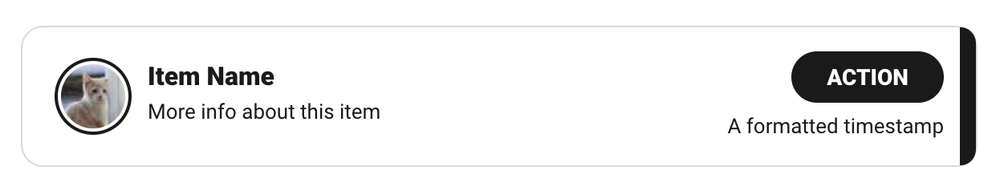
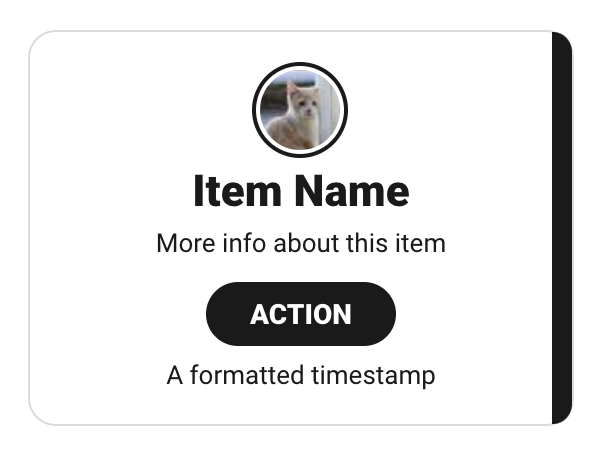

# Goal

Write a React application that consumes any public API. The objective is to
build an app that displays data from the API and supports pagination to display
more data. Provided are some card/item designs to loosely base the mobile and
desktop layouts off of.

Feel free to use a public API of your choice, e.g. https://github.com/public-apis/public-apis#games--comics. Please don't let this decision consume too much of your time; if you are having trouble finding an API to your liking, consider using the [NPPES API](https://npiregistry.cms.hhs.gov/registry/help-api) which offers information on healthcare providers registered in US (click the "Demo" link for an interactive query generator).

#### Desktop Card Example

#### Mobile Card Example

## Expectations

Try to time-box the exercise at ~3 hours. It's very possible that certain items don't get finished- if that's the case, try to save a few minutes to summarize your efforts in the README or email.

## Requirements

### UI/UX

- Page-level
  - Display data in a list using React
  - Should be able to paginate/infinite scroll to get at more results
  - Improvise the layout of the page surrounding the cards and be as creative as
    you like
- Card-level
  - Use provided images as an example for what an item in the list might look
    like, but take liberties with the provided designs as they are not set in
    stone
  - The entire card should be clickable to go to another page (can click to
    google.com and does not need to be a detail/show page associated with the API)
  - The card should also have a button within it that triggers a separate action
    (can launch a browser confirm/alert)
  - Add your own flair for things like hover states and colors that are used
- Create both mobile and desktop layouts and show that you know some CSS (no
  bootstrap or tailwind)

### Technical

- Provide documentation or instructions on how to run the application
- Limit 3rd party libraries to only "must haves" (no 3rd-party component libraries)
- Leverage Git, and demonstrate your workflow / style via commits
- Ensure there are some tests included (e2e/integration/unit/static/etc..)

### Logistical

Below are a few options on how to attach your project to the email.

- Option 1: Zip up the entire project directory and attach the zip to the email as an attachment
- Option 2: Upload your project to a public Git repository and include a link to the repository in the email
- Option 3: Upload a zip of the entire project directory to a publicly accessible storage such as DropBox and include a link to the zip in the email

Email your solution to engineeringjobs@cirrusmd.com, include 'Front End Software Engineer Take-Home' in the subject line.

## Evaluation

The qualities we're looking for are:

- **Clarity**: is the code organized and structured well, is it easy to read and comprehend?
- **Maintainability**: if it had to be updated / extended how easy would that be?
- **Testability**: are the tests comprehensive and covering the appropriate use cases?

## Questions

If you have questions about the instructions, please ask. We want you to be
successful. If you have a question about how to handle something that wasn't
specifically addressed, make a decision and feel free to call it out in your
readme or email with your reasoning behind your decision. There are no right or wrong
answers for these types of things.
